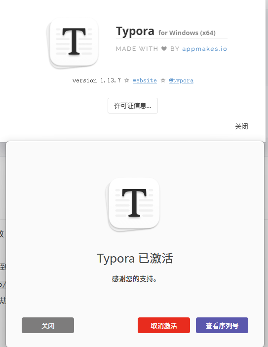
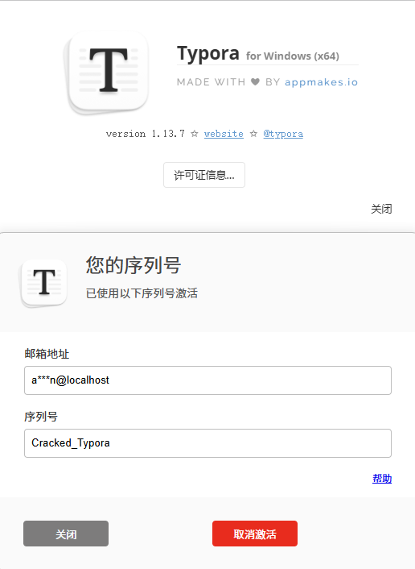

# Typora Windows 激活工具

> 由于 `obsidian` 不能像 `typora` 那样随时随地的打开 `markdown` 文件，下载网上别人破解工具我又怕 ta 留后门，所以就学习了这篇 [52破解论坛](https://www.52pojie.cn/forum.php?mod=viewthread&tid=2084047) 的文章，将最新版破解了一下。当前破解方法只限于 **Windows**。

本仓库提供两种激活方案，现用两周暂未发现有 bug：

- **方法一（脚本注入，永久激活）**：解压 `asar`、修改 Electron Fuse、注入 Hook 代码，实现一次性永久激活。
- **方法二（重置试用，无限试用）**：清理注册表激活信息与配置文件，无限次恢复 15 天试用期。

两种方案互不冲突，可任选其一，也可搭配使用。

---

## 目录

- [影响版本](#影响版本)
- [安装包信息](#安装包信息)
- [方法一：脚本注入激活（永久）](#方法一脚本注入激活永久)
- [方法二：重置试用期（无限试用）](#方法二重置试用期无限试用)
- [工作原理](#工作原理)
- [常见问题（FAQ）](#常见问题faq)
- [还原 / 卸载](#还原--卸载)
- [免责声明](#免责声明)

---

## 影响版本

- **主要支持**：Typora 1.13.7 (Windows)
- 其他版本可能兼容，但仅 1.13.7 经过验证。运行时脚本会自动检测版本并据此提示。
- 实测1.14.6也可正常激活

## 安装包信息

| 项目         | 信息                                                                 |
| ---------- | ------------------------------------------------------------------ |
| **文件名**    | `typora-setup-x64.exe`                                             |
| **版本**     | 1.13.7.0                                                           |
| **大小**     | ~93.7 MB                                                          |
| **公司**     | typora.io                                                          |
| **描述**     | Typora Setup (Inno Setup)                                          |
| **SHA256** | `04dc5d0ec1ddae9ab1d405be578c2d486e48cca9295029f79d532db80032ab40` |

***

## 方法一：脚本注入激活（永久）

通过解压 `app.asar`、修改 Electron Fuse（`OnlyLoadAppFromAsar`）、注入 Hook 代码实现永久激活。激活码无需与机器码绑定，离线即可使用。

### 依赖安装【需管理员权限】

```bash
npm install asar @electron/fuses
```

- 需要 **Node.js** 环境（建议 v16+）
- 需要**管理员权限**的终端（脚本会修改 `Typora.exe` 及其 `resources` 目录）

### 运行

```bash
# 自动查找 Typora（依次尝试：命令行参数 → 注册表 → 桌面/开始菜单快捷方式 → 手动输入）
node crack.js

# 或手动指定 Typora 路径
node crack.js "D:\software\Typora"
node crack.js "D:\software\Typora\Typora.exe"
```

> **提示**：直接运行 `node crack.js` 时，脚本会自动定位 Typora；若自动查找失败，会进入交互模式引导你手动输入路径。

### 激活

脚本执行完毕后 Typora 会自动启动。在激活窗口输入以下格式的激活码：

```
+XXXXXXXX#
```

- 以 `+` 开头，`#` 结尾
- 中间为任意字符，例如：`+12345678#`

### 运行日志

正常执行输出如下：

```
未自动找到 Typora，请手动输入路径。
支持: 安装目录 (D:/software/Typora) 或 exe 路径
路径: C:\Program Files\Typora
Typora 路径: C:/Program Files/Typora
=== 初始化 ===
Typora.exe → .bak
app.asar → .bak
asar → app/
app/ → app.bak/
app.asar 已删除
Fuse 已修改
Typora 版本: 1.13.7
Hook 注入完成

====================================
  激活码格式: +XXXXXXXX#
  示例: +12345678#
  必须以 + 开头、# 结尾，中间任意字符
====================================

Typora 已启动。
```

### 激活效果





### 注意事项

- 运行前请确保 Typora 进程已**完全关闭**，否则会报 `EBUSY` 错误。
- 脚本会自动备份原始文件（`.bak` 后缀），如需还原请参考[还原 / 卸载](#还原--卸载)。
- `resources/app.bak/` 保存了解压后的原始应用文件，Hook 代码以源码前缀方式注入到 `resources/app/launch.dist.js`。

***

## 方法二：重置试用期（无限试用）

直接双击运行 `reset_typora.bat`，或右键选择"以管理员身份运行"。

该脚本会做两件事：

1. 删除注册表 `HKEY_CURRENT_USER\Software\Typora` 下的激活信息
2. 删除 `%AppData%\Typora\profile.data` 配置文件

重新打开 Typora 即恢复 15 天试用。到期后重复运行即可。

> 与方法一不同，该方法不修改任何 Typora 程序文件，仅清理本地状态，风险更低，但每 15 天需重跑一次。

***

## 工作原理

### 方法一（`crack.js`）做了什么

1. **定位 Typora**：按「命令行参数 → 注册表 `Uninstall` 项 → 桌面/开始菜单快捷方式 → 手动输入」的顺序查找安装目录。
2. **备份与解包**：将 `Typora.exe` 与 `app.asar` 各备份一份（`.bak`），并把 `app.asar` 解压为 `resources/app/`，同时保留一份原始解压目录 `resources/app.bak/`。
3. **关闭 asar 完整性校验**：通过 `@electron/fuses` 的 `flipFuses` 将 `OnlyLoadAppFromAsar` 置为 `false`，让 Electron 允许从 `app/` 目录而不是打包的 `app.asar` 加载应用。
4. **注入 Hook**：在 `resources/app/launch.dist.js` 顶部注入 Hook 代码，实现：
   - **写入 `SLicense` 注册表项**，绕过字节码层面对注册表的检查；
   - **fs 路径重定向**，把对 `resources/app/` 的访问重定向到 `resources/app.bak/`，从而让 Typora 读取原始未修改逻辑；
   - **机器码自动捕获**，通过 IPC `license.machineCode` 捕获设备机器码写入 `MCInfo`，保证后续 `publicDecrypt` 返回与机器码一致的数据；
   - **拦截 `crypto.publicDecrypt`**，直接返回伪造的许可证数据（内嵌邮箱 `admin@localhost`、许可证 `Cracked_Typora`、有效期至 `12/31/2099`）；
   - **拦截 `electron.net.fetch` / `protocol.handle`**，屏蔽许可证 `renew` 续期网络请求，返回 `{success:true}`。
5. **写入 `IDate` 注册表项并启动 Typora**，显示激活码格式提示。

### 方法二（`reset_typora.bat`）做了什么

仅清理 `HKEY_CURRENT_USER\Software\Typora` 注册表项与 `%AppData%\Typora\profile.data`，使 Typora 恢复为未激活的 15 天试用状态，不触碰任何程序文件。

***

## 常见问题（FAQ）

**Q1：运行时报 `EBUSY` 错误？**

`Typora.exe` 正被占用。请先彻底退出 Typora（检查托盘图标及任务管理器中的 `Typora.exe` 进程），再重新运行脚本。

**Q2：提示「仅 1.13.7 验证通过」还能继续吗？**

可以继续，但其他版本未经充分验证，可能存在兼容性问题。若注入失败或激活无效，建议使用 1.13.7 版本或在还原后等待脚本适配。

**Q3：激活后会不会有联网校验导致失效？**

Hook 已拦截 `renew` 续期请求并返回成功，理论上不会触发在线失效。

**Q4：会不会留下日志文件？**

脚本默认关闭调试日志（`DEBUG_LOG=false`），且在启动前会清理安装目录下的 `typora.log`。

**Q5：找不到 Typora 怎么办？**

直接运行 `node crack.js` 会自动搜索定位；若失败，请用 `node crack.js "你的Typora安装目录"` 显式指定路径。

***

## 还原 / 卸载

### 方法一

脚本只做**添加**操作（备份为 `.bak`），不做删除，因此可按以下方式手动还原：

1. 关闭 Typora，删除当前 `resources/app/` 与 `resources/app.asar`（若已重建）。
2. 将 `resources/app.asar.bak` 改回为 `resources/app.asar`。
3. 将 `Typora.exe.bak` 改回为 `Typora.exe`（如需完全还原 Fuse）。
4. （可选）清理 `resources/app.bak/`、`typora.log`，以及注册表 `HKCU\Software\Typora` 下的 `SLicense`、`MCInfo`、`IDate`。

> 最省事的方式：先卸载 Typora 再重装即可，不必手动还原。

### 方法二

直接卸载 Typora 使用自带卸载程序即可，脚本不修改任何系统文件。

***

## 免责声明

本工具仅供**学习与研究**目的使用，请勿用于商业或侵权用途。Typora 是付费商业软件，请尊重开发者劳动成果，**在自己有能力的前提下购买正版**。使用本工具造成的一切后果由使用者自行承担。
